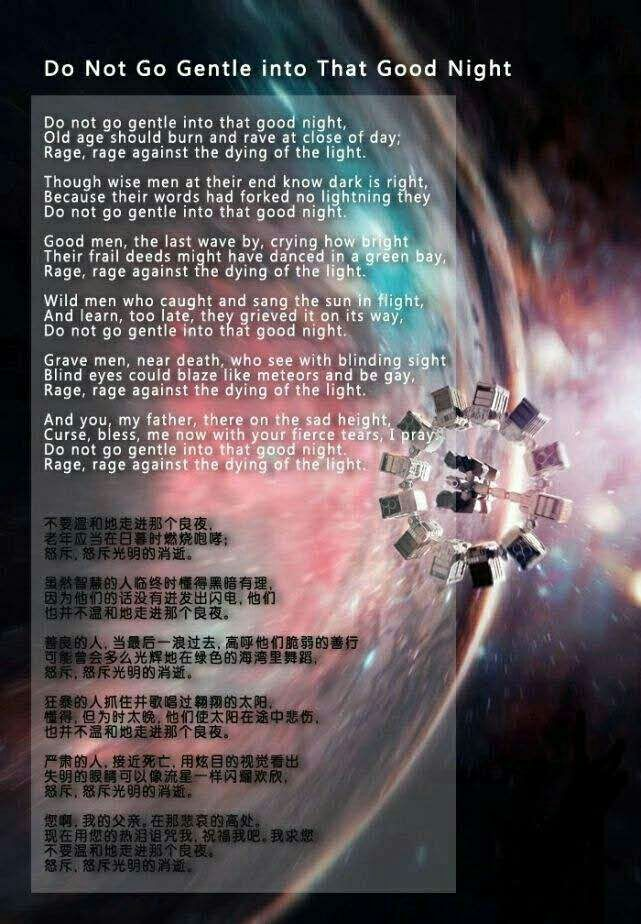

### 座佑铭
不忘初心，方得始终。   
### 个人喜欢的歌
[《The mass》](https://baike.baidu.com/item/The%20Mass/372217)    
歌词:     
Semper crescis aut descrescis    
变化无常盈虚交替     
Vita detestabilis   
可恶的生活   
Nunc obdurat et unc curat ludomentis aciem   
把苦难和幸福交织在一起   
Nunc obdurat et unc curat ludomentis aciem   
把苦难和幸福交织在一起   
Egestatem potestatem dissolvit ut glaciem   
无论贫贱与富贵命运之轮   
Divano   
神圣的    
Divano re  
神圣的 弥   
Divano resi   
神圣的 弥赛   
Divano resia     
神圣的 弥赛亚    
Divano resia    
神圣的 弥赛亚              
Divano                    
神圣的                
Divano re  
神圣的 弥                
Divano resi                   
神圣的 弥赛               
Divano resia   
神圣的 弥赛亚  
Divano resia   
神圣的 弥赛亚  
Sors salutis et virtutis michi nun contraria  
我的健康和美德被命运摧残着  
Est affectus et defectus semper in angaria  
与意志疲劳不堪永远疲于奔命  
Hoc in hora sinc mora corde pulsum tangite 
就在此刻不要拖延让琴弦拨响  
Divano  
神圣的     
Divano me      
神圣的 弥         
Divano messi         
神圣的 弥赛         
Divano messia         
神圣的弥赛亚          
Divano messia             
神圣的 弥赛亚          
Divano          
神圣的             
Divano me             
神圣的 弥             
Divano messia          
神圣的 弥赛             
Divano messia             
神圣的 弥赛亚             
Divano messiamessiamessiamessia             
神圣的 弥赛亚弥赛亚弥赛亚弥赛亚             
Divano           
神圣的                
Divano me                
神圣的 弥                
Divano messi                
神圣的 弥赛             
Divano messia                
神圣的 弥赛亚                   
Divano messiamessiamessiamessia             
神圣的 弥赛亚弥赛亚弥赛亚弥赛亚             
(Divano)                
（神圣的）                
Sors salutis et virtutis michi nun contraria          
我的健康和美德被命运摧残着                   
Est affectus et defectus semper in angaria                         
与意志疲劳不堪永远疲于奔命                               
Hoc in hora sinc mora corde pulsum tangite                            
就在此刻不要拖延让琴弦拨响                               
Divano                         
神圣的                
Divano me                
神圣的 弥                
Divano messi                   
神圣的 弥赛                      
Divano messia                   
神圣的 弥赛亚                
Divano messia                
神圣的 弥赛亚                   
Divano                
神圣的             
Divano me                
神圣的 弥                
Divano messi                
神圣的 弥赛             
Divano messia                
神圣的 弥赛亚                   
Divano messia                       
神圣的 弥赛亚                   
Hoc in hora sinc mora corde pulsum tangite                      
就在此刻不要拖延让琴弦拨响                      
Quod per sortem sternt fortem mecum omnes plangite                
因为命运也已被命运击垮要把痛苦全部消灭。             

作者之所以会选此歌，只因为此歌听起来余（yǒu）音（diǎn）绕（shàng）梁（tóu）
### 站诗
[《不要温和地走进那良夜》（Do not go gentle into that good night）](https://baike.baidu.com/item/%E4%B8%8D%E8%A6%81%E6%B8%A9%E5%92%8C%E5%9C%B0%E8%B5%B0%E8%BF%9B%E9%82%A3%E4%B8%AA%E8%89%AF%E5%A4%9C/8670983?fr=aladdin#reference-[2]-3268076-wrap)  
作者:狄兰·托马斯     
译者:巫宁坤     
全诗:  
Do not go gentle into that good night,  
不要温和地走进那良夜，  
Old age should burn and rave at close of day;   
老年应当在日暮时燃烧咆哮；  
Rage, rage against the dying of the light.  
怒斥，怒斥光明的消逝。  
Though wise men at their end know dark is right,   
虽然智慧的人临终时懂得黑暗有理，    
Because their words had forked no lightning they  
因为他们的话没有迸发出闪电，他们  
Do not go gentle into that good night.  
也并不温和地走进那个良夜。  
Good men, the last wave by, crying how bright   
善良的人，当最后一浪过去，高呼他们脆弱的善行  
Their frail deeds might have danced in a green bay,   
可能曾会多么光辉地在绿色的海湾里舞蹈，    
Rage, rage against the dying of the light.   
怒斥，怒斥光明的消逝。  
Wild men who caught and sang the sun in flight,  
狂暴的人抓住并歌唱过翱翔的太阳，  
And learn, too late, they grieved it on its way,   
懂得，但为时太晚，他们使太阳在途中悲伤，   
Do not go gentle into that good night.   
也并不温和地走进那个良夜。   
Grave men, near death, who see with blinding sight   
严肃的人，接近死亡，用炫目的视觉看出  
Blind eyes could blaze like meteors and be gay,  
失明的眼睛可以像流星一样闪耀欢欣，   
Rage, rage against the dying of the light.   
怒斥，怒斥光明的消逝。  
And you, my father, there on the sad height,   
您啊，我的父亲．在那悲哀的高处．      
Curse, bless me now with your fierce tears, I pray.   
现在用您的热泪诅咒我，祝福我吧．我求您   
Do not go gentle into that good night.    
不要温和地走进那个良夜。  
Rage, rage against the dying of the light.    
怒斥，怒斥光明的消逝。   

作者之所以选这首诗为站诗，是因为以下几点:   
1.这首诗是作者喜欢的电影《星际穿越》中的主题诗  
2.这首诗读起来也好听(除了倒数第3,4句,我是不会认这个坑的)   
3.这首诗也希望这个网站遇到什么打击也不会温和地走进那个"良夜"        
## 捐赠      
### 作品不精,有愧捐赠
